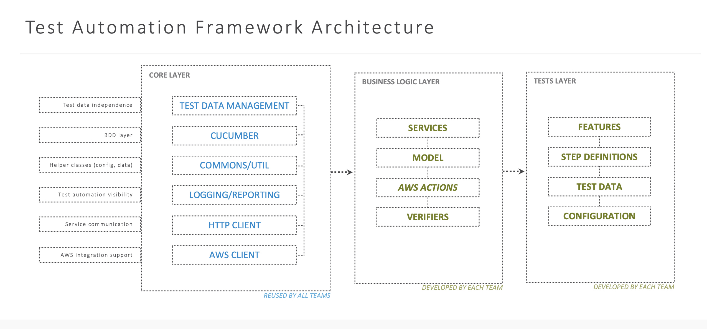
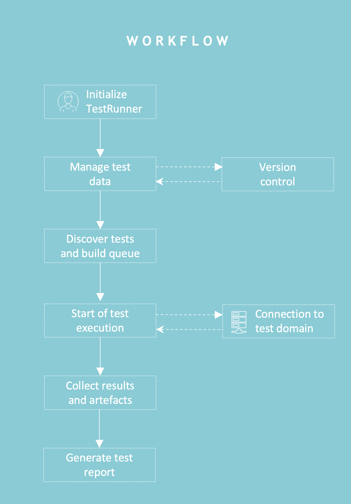
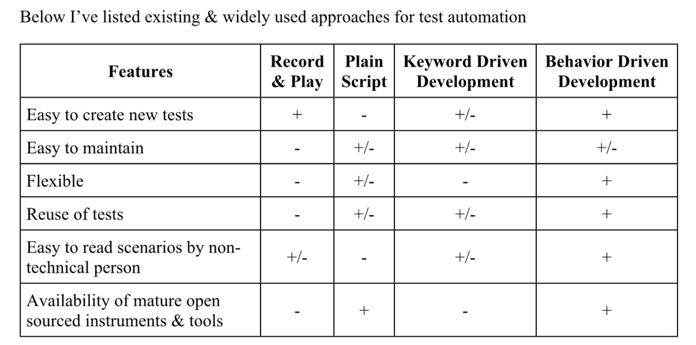
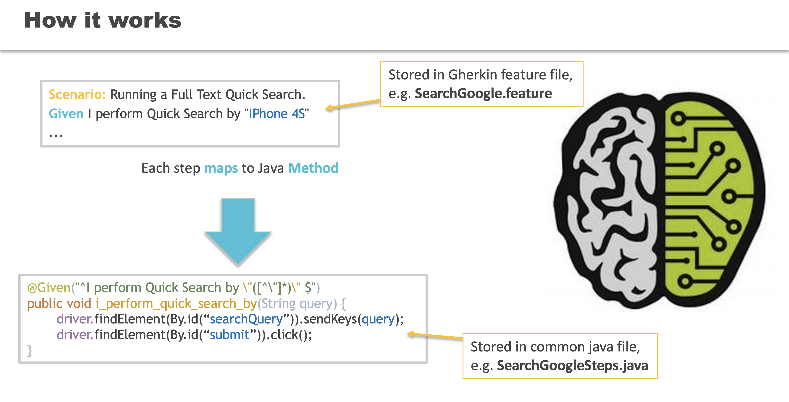
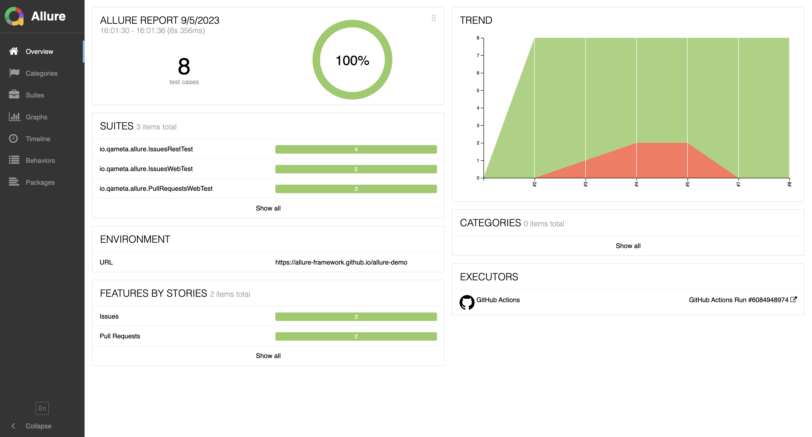
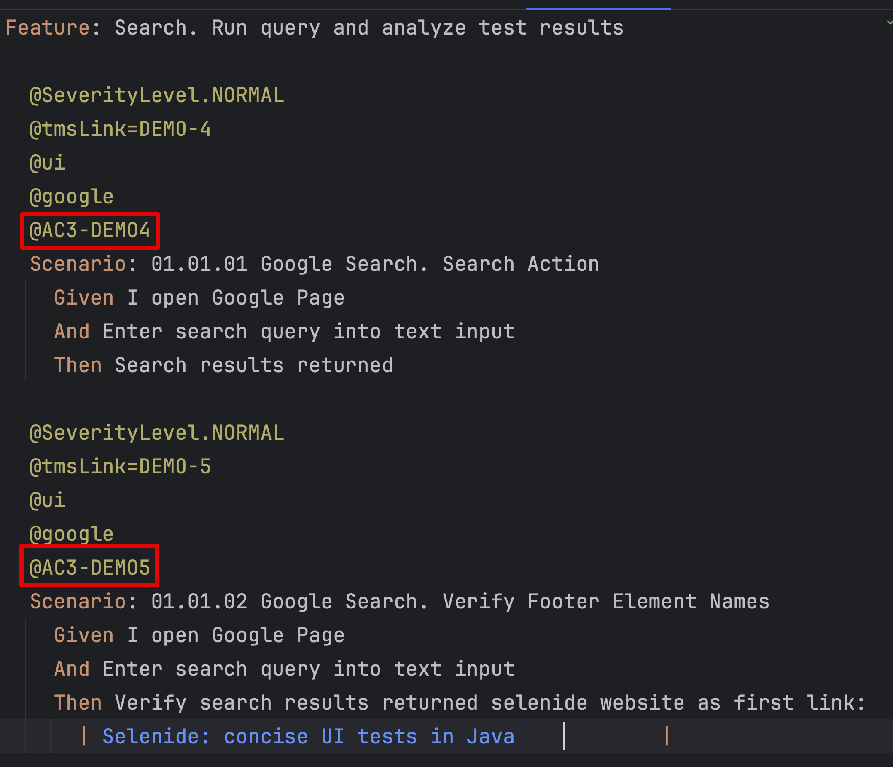

# Test Automation Framework - Test Breeze

## Preface

In order to allow Symphony QA and development teams to create **versatile, reusable and self-explanatory automated tests** it’s important to have solid backbone is the form of **multipurpose, modular test automation framework** (aka **TAF**) consisting of core layers for interaction with desktop/mobile UI, back-end i.e. REST API, Cloud services, etc.) and generally purpose helper utilities (authorisation, test data handler, environments management, logging, reporting, etc.)

**Setting up test-automation process and building initial framework implies substantial initial investment in terms of time and resources** and continuous time allocated on maintenance of created tests.

**Test Breeze** is an **open source** **Java** project and **test automation framework boilerplate** developed with goal of tackling complexities associated with building initial framework and implements **best practices** of test automation industry

## Problem Statement
- **Lack** of standardised test automation solutions for **acceptance and system testing** in various Symphony teams
- Test automation framework solutions **vary project by project**
- Solutions created from scratch for the same problem multiple times, usually **deeply coupled** with the business area
- Limited test automation **visibility & traceability**

## Proposed Test Automation Framework Architecture

### Benefits

- **Modularised, layered approach** (core framework containing the necessary features as a starter pack) 
- Built-in, **scope independent common features**, enabling test implementation from the 1st delivery sprints 
- Increased test automation **velocity** with fully scalable solution
- **Extensive documentation**, guideline as part of the starter package
- Test automation **health visibility**, history of executions 
- Quick integration with **CI/CD** (via Maven)
- Increased **efficiency in debugging & troubleshooting** with extended **reporting**

### Test Runner

- **Fully controlled** test execution flow from start to end
- Centralised, **CI/CD compliant easy-to-integrate solution**, layered test scripts (smoke/bvt, regression) integrated into the product 
pipeline and triggered automatically
- **Built-in test data management** ensuring test independence and repeatability
- Local execution support enabling **troubleshooting and root cause analysis**
- **Testing artefacts and evidences** required for the internal delivery process are automatically generated by the test automation solution 
- Built-in test executor (**Cucumber**), no need for custom/team specific implementation once the solution is in use

## Test Automation Framework Core Principles

| **Description**                | **Target goals**                                                                                                                                                                           |
|--------------------------------|--------------------------------------------------------------------------------------------------------------------------------------------------------------------------------------------|
| Runs often & Fast              | Reasonable time for execution - sanity test suite < 3- 5 min, smoke test suite < 15 min, regression < 1-2 hours                                                                            |
| Transparent                    | Reports of the execution outcome available to everyone (via http link or CI pipeline build overview)                                                                                       |
| Predictable result             | Tests executed multiple time for same build have predictable outcome, low amount of “flaky“ tests, time spent on maintenance of existing tests is acceptable (less than 30% of total time) |
| Configurable                   | Easy configuration of environment specific properties (URI, end- points, OS/browser/device versions, etc.)                                                                                 |
| Support for parallel execution | Test Automation framework should allow parallel execution of tests decreasing time spent on test execution                                                                                 |
| Documented                     | Well documented - README file have all necessary information about how to build and run tests                                                                                              |

## Cucumber & BDD Approach Benefits 

[Behavior-driven development](https://en.wikipedia.org/wiki/Behavior-driven_development) (BDD) is an Agile software development methodology in which an application is documented and designed around the behaviour a user expects to experience when interacting with it. By encouraging developers to focus only on the requested behaviours of an app or program, BDD helps to avoid bloat, excessive code, unnecessary features or lack of focus. This methodology combines, augments and refines the practices used in test-driven development ([TDD](https://www.techtarget.com/searchsoftwarequality/definition/test-driven-development)) and [acceptance testing](https://www.techtarget.com/searchsoftwarequality/definition/acceptance-test).

Based on that chart above BDD is the most reasonable way of implementing automated tests that will be relatively easy to maintain, reused and easy to understand by engineer and non-technical specialist

## Source Code Repository

Source code of **Test Breeze** framework along with automated tests are available at

[Test-Breeze: This is a boilerplate for versatile test automation framework created with Java, Spring, Cucumber and Allure ](https://gitlab.ci.customers.symphony-solutions.cloud/testbreeze/testbreeze)

Tests are developed in [Java ](https://www.oracle.com/java/)with [Spring](https://spring.io/), [Selenide](https://selenide.org/), [Rest Assured](https://rest-assured.io/), [Cucumber](https://cucumber.io/) and utilising [Allure ](https://allurereport.org/) as reporting system. [Maven ](https://maven.apache.org/)build automation tool used for building source code, running tests and producing test reports

## How to run locally

[ReadMe](https://gitlab.ci.customers.symphony-solutions.cloud/testbreeze/testbreeze/-/blob/main/ReadMe.md) of **Test Breeze** TAF contains instructions on how to set up project locally, run tests and describe preconditions that should be pre-installed.

### Environment specific configurations

Environment specific configurations could be set in following property files:

for UI tests - [link](https://gitlab.ci.customers.symphony-solutions.cloud/testbreeze/testbreeze/-/tree/main/acceptance-tests/src/test/resources/properties/env)

for API tests - [link](https://gitlab.ci.customers.symphony-solutions.cloud/testbreeze/testbreeze/-/tree/main/acceptance-tests/src/test/resources/properties/endpoint)

## Reporting overview

In order to have convenient access to test automation results visual reporting solution should be integrated into TAF 

Requirements for reporting solution are following 

- Test automation health visibility, history of executions
- Summary statistics and visual representation of figures using charts
- Capability to attach stack trace, trace logs, screenshots in case of test failures in order to help with troubleshooting 

Based on the above list [Allure](https://allurereport.org/) reporting library is used with **Test Breeze**

Proposed demo example could be accessed [here](https://allure-framework.github.io/allure-demo/8/)

### HTML Reports

[Allure](https://allurereport.org/) html test report will be generated under `acceptance-tests/target/site` folder after each test execution

In order to view allure reports use `allure open` command i.e. `allure open -h localhost acceptance-tests/target/site`

In order to change the Allure configurations update following file [allure.properties](https://gitlab.ci.customers.symphony-solutions.cloud/testbreeze/testbreeze/-/blob/main/acceptance-tests/src/test/resources/allure.properties) accordingly

## Integration with CI/CD
**Test Breeze** allows easy integration with any CI/CD tools supporting maven test runner. Sample CI pipeline configuration compatible with GitLab CI available in [.gitlab-ci.yml](https://gitlab.ci.customers.symphony-solutions.cloud/testbreeze/testbreeze/-/blob/main/.gitlab-ci.yml) file. 

Results of GitLab CI pipeline executions available under following [link](https://gitlab.ci.customers.symphony-solutions.cloud/testbreeze/testbreeze/-/pipelines)

## Integration with 3rd party systems

**Test Breeze** TAF include mechanism for integration with 3rd party systems such as quality management tools (i.e. TestRails) and issue tracking system such as Jira

Cucumber tags could be used for traceability between test cases and Gherkin scenario

## Expected maintenance

To ensure safe and reliable operation of the framework the following steps should be taken:
1. Dependencies management - deprecated libraries and outdated dependencies should be timely updated and validated. 
2. Test cases management - test cases should be periodically reviewed for its business value and updated when necessary.
3. In case of existence of warnings detected by static code analysis tools in IDE - resolve these warnings.
